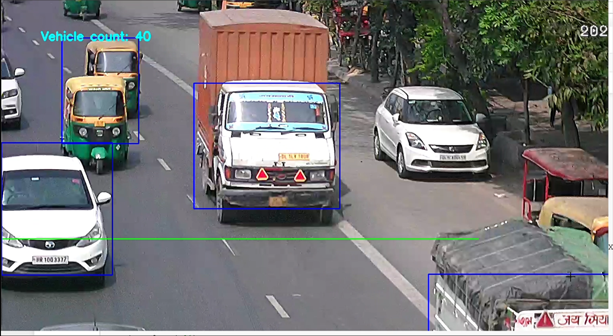

# VEHICLE DETECTION

This Sample Project focuses up on vehicles Detection and Counting them using OpenCV library.

## Why I use OpenCV 

There are several ways we can use for Vechile Detection and Counting.
 We can use OpenCV alone or even include it with Tensorflow and keras librarys.

Using Tensorflow involves using ANN(Artificial Neural Net) or CNN (Convolution Neural net) Which gives way more accurate model then using OpenCV alone but it tooks a lot of time Preparing dataset images, preprocessing them and training them and then testing again and again while making some changes to increase accuracy. It is a very lenthy process but accurate.

We can also use pre trained models which will saves us a lot of time and clames to be much accurate like YOLOv3, YOLOv4, VGG-16 etc.
But they require GPUs working on your systems otherwise it will work way slower then a sloth (you know sloths write sleeping on trees all day!!).

but there is an other way which requires only OpenCV and it is quick and easy to understand. Thtough OpenCV we can also acess some of the DeepLearning Functionalities with a single line of code.

The code is breafly explained in Jupyter notebook

## Installation

You need to install following libraries
if you are using python
```bash
pip install opencv-python
pip install matplotlib
pip install numpy
```
if you are using Anaconda
```bash
conda install -c conda-forge opencv
conda install -c conda-forge matplotlib
conda install -c anaconda numpy
```
## Output


## Code

```python
video = cv2.VideoCapture("./videos/video_1.mp4")

## reading first frame
_, frame1 = video.read()

count = 0
while video.isOpened():
    ## reading the second frame
    _, frame2 = video.read()
    
    if _ == False:
        break
    # making a copy of frame2 
    frame = frame2.copy()

    ## uding absolute difference to get the mask image
    absdiff_mask = cv2.absdiff(frame1, frame2)
    gray_absdiff_mask = cv2.cvtColor(absdiff_mask, cv2.COLOR_BGR2GRAY)
    
    ## appling the threshold on the absolute difference
    _, thresh = cv2.threshold(gray_absdiff_mask, 50, 255, cv2.THRESH_BINARY)
    #cv2.imshow("image with Threshold", thresh)
    
    ## displaying a line on the the frame
    cv2.line(img = frame, pt1 = (0, 600), pt2 = (1200, 600), color = (0,255,0), thickness = 2)
    
    contours, hierarchy = cv2.findContours(thresh, cv2.RETR_TREE, cv2.CHAIN_APPROX_SIMPLE)
    
    for i in contours:
        # If the area of contoure is smaller then 20000 then we will not consider it
        if cv2.contourArea(i) < 20000:
            continue
                    
        x,y,w,h = cv2.boundingRect(i)
        # Drawing a rectangle around the moving objects
        cv2.rectangle(img = frame, pt1 = (x,y), pt2 = (x+w, y+h), color = (255, 0,0), thickness = 2)
        
        # Calculating ymid of the rectangles
        ymid = (y + (y+h))/2
        # when the rectangle comes in the range 570-630 then the count will be increased
        if ymid > 570 and ymid < 630:
            count += 1
    # Preparing the text to be displayed up on screen 
    text = "Vehicle count: "+ str(count)
    # writing the text on the screen
    frame = cv2.putText(img = frame, text = text, org = (100,100), fontFace = cv2.FONT_HERSHEY_SIMPLEX,
                        fontScale = 1, color = (255,255,0), thickness = 3)
    # Displaying the final result
    cv2.imshow("frame", frame)
    
    # making the current frame as frame1
    frame1 = frame2
    if cv2.waitKey(1) & 0xff == ord('q'):
        break
    time.sleep(.01)
video.release()
cv2.destroyAllWindows()
```

